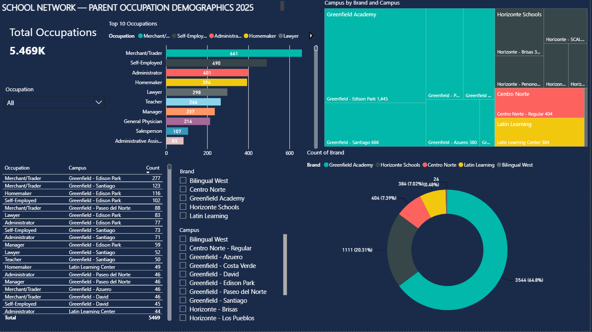

Student Housing Demographics Dashboard — School Network (2025)
Overview
Interactive Power BI dashboard analyzing the residential distribution of 6,481 students across a 5-brand, 15-campus private school network in Panama.
Built using anonymized operational data to demonstrate end-to-end data analysis: from raw CRM exports to executive-ready visualizations.
Dashboard Preview

Key Insights
Greenfield Academy accounts for 59% of total student population (3,829 students)
Horizonte Schools is the second largest brand with 1,318 students across 5 campuses
Greenfield - Edison Park is the largest single campus with 1,445 students
Most students are concentrated in Panama City districts, particularly Betania and Ancón
7% of district data reflects incomplete CRM entries — standard in live operational datasets
Visualizations
KPI card: Total student count
Treemap: Student distribution by brand and campus
Horizontal bar chart: Top campuses by enrollment
Bar chart: Students by brand
Donut chart: % distribution by brand
Geographic table: Districts and subdistricts breakdown
Slicers: Filter by brand and campus
Tools Used
Tool	Purpose
Power BI Desktop	Dashboard design and visualization
Microsoft Excel	Data cleaning and structuring
DAX	Calculated measures
Python (pandas, openpyxl)	Data preprocessing
Data
Source: Anonymized CRM export (Salesforce)
Records: 6,481 student entries
Fields: Brand, Campus, District, Subdistrict
Year: 2025
Skills Demonstrated
`Power BI` `Data Visualization` `Dashboard Design` `Excel` `Data Cleaning` `DAX` `CRM Data`
